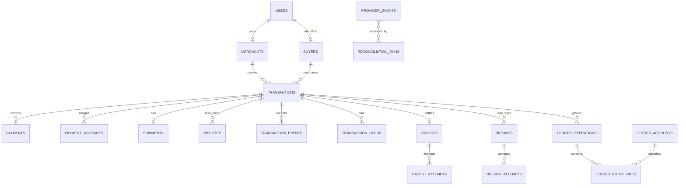

# M1-02 Database Schema

## Status

This milestone establishes the PostgreSQL schema, migration, database boundary, and persistence contracts. It does not execute payment, payout, refund, courier, authentication, or KYC workflows.

## ID strategy

Internal identifiers are UUIDs generated by PostgreSQL using `gen_random_uuid()`. UUIDs are opaque and non-sequential. Public payment-link tokens are intentionally deferred and are not represented as a public API in this milestone. `public_reference` is an internal transaction reference with a uniqueness constraint, not a payment-link token.

## Migration strategy

Migrations are version-controlled SQL files under `database/migrations`. The `001_initial_schema.up.sql` migration is reproducible from an empty PostgreSQL database. The matching down migration exists for controlled development/test rollback only. Production must use forward-only migrations; destructive rollback is not an operational production strategy.

Automatic schema synchronization is not used.

## Tables

`users`, `merchants`, `buyers`, `configuration_versions`, `transactions`, `payments`, `payment_accounts`, `shipments`, `disputes`, `transaction_holds`, `transaction_events`, `transaction_terms_acceptances`, `idempotency_keys`, `payouts`, `payout_attempts`, `refunds`, `refund_attempts`, `provider_events`, `reconciliation_runs`, `reconciliation_items`, `ledger_accounts`, `ledger_operations`, `ledger_entry_lines`, `audit_logs`, `risk_assessments`, `kyc_documents`, and `notification_deliveries`.

## ER diagram

## Important constraints

- all monetary values are non-negative `BIGINT` minor units;
- currency is explicit `CHAR(3)` and uppercase;
- provider event identity is unique on `(provider, event_id)`;
- provider payment references are unique when present;
- one logical payout exists per transaction;
- payout/refund attempt numbers are unique per logical operation;
- idempotency keys are unique within `scope`;
- foreign keys protect entity relationships;
- append-only triggers reject update/delete for event, provider, reconciliation, ledger, and audit records;
- no provider-specific statuses are represented as domain enums.

## Security-sensitive fields

`encrypted_account_number`, `account_number_fingerprint`, identity/document provider references, dispute evidence references, and audit metadata require access controls. Encryption-key management and KYC workflows are deferred.

## Indexing strategy

Indexes cover merchant/buyer transaction retrieval, statuses and queues, provider references, transaction timelines, holds, disputes, payout state, ledger lookup, audit resources, and idempotency scope. No provider or application behavior is implemented by this migration.

## Accounting limitation

The ledger account categories are architectural placeholders. Final statutory accounting treatment for provider fees, refunds, reversals, chargebacks, and partial settlements is `UNKNOWN — REQUIRES CONFIRMATION` from accounting and legal professionals.

## Deferred

- domain transition enforcement
- full repository CRUD commands
- provider integrations
- reconciliation jobs
- authentication and RBAC
- financial posting engine
- test fixtures and seed data
